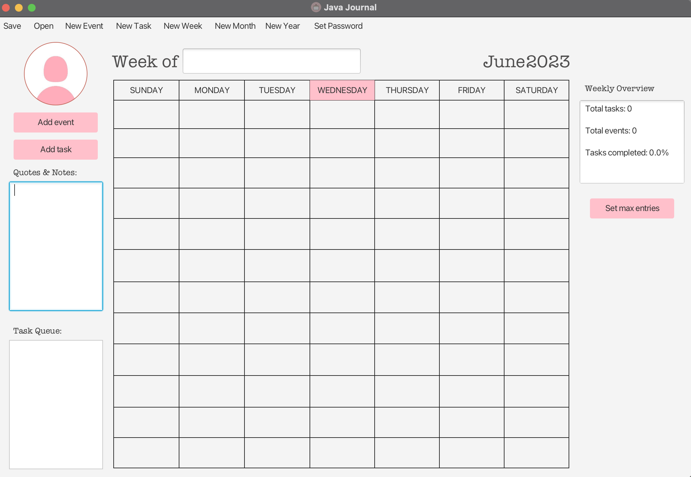

# 3500 PA05 Project Repo

[PA Write Up](https://markefontenot.notion.site/PA-05-8263d28a81a7473d8372c6579abd6481)

# JavaJournal by mvc2
- Features:
  - Splash screen with pretty icon
  - Password screen (initial password is cs3500)
  - Upload your own custom profile picture
  - Pink buttons and current day highlighted in pink
    - Pink buttons for new event, new task, and set new maximum (tasks/events)
  - Notes and quotes feature
  - Task queue showing all tasks that haven't been completed
  - Weekly overview showing the total tasks, total events, and total tasks completed
  - Menu bar
    - Menu bar with shortcuts for each menu bar item including:
    - Save to file (CTRL + S)
    - Open from file (CTRL + O)
    - New event (CTRL + E)
    - New task (CTRL + T)
    - Set new week (CTRL + N)
    - Set new month (CTRL + M)
    - Set new year (CTRL + Y)
    - Set new password (CTRL + P)
  - When a task or event is added, it will show up on the journal under its set day
    - Clicking on a task or event that was added will bring up a mini viewer, where you can set a task as complete
    - You can also edit a task or event the same way
# GUI SCREENSHOT

# SOLID PRINCIPLES
- Single Responsibility
  - Each class has its own responsibility. For example, JavaJournalView and PopupView both handle the creation of stages and scenes, which are then handed off to the controller as the controller wishes to use them. The controller handles both the model and controller. You will notice that JavaJournalControllerImpl has both a Journal (model) and a popupView (view).
- Open/Closed
  - We have interfaces so that if you so wished, you could implement the JavaJournal without having to recode a majority of the features. In other words, open for extension and closed for modification. You can add your own features using our interfaces, but you cannot modify existing code.
- Liskov Substitution
  - The subclasses of abstract class JournalEntry behave just like JournalEntry does. In simpler terms, JournalEntry can be replaced with either Task or Event and no problems will be created. The code will still compile. We have done this in multiple places (e.g. JournalEntry task v.s. Task task).
- Interface segregation 
  - Classes (for example, JavaJournalControllerImpl and JavaJournalViewImpl) have their own interfaces. These interfaces hold methods that are used when launching the application.
- Dependency Inversion
  - Our subclasses are not dependent on a superior class. More specifically, Task and Event do not change anything inside JournalEntry, they only override some methods in JournalEntry and use the super() constructor.
# Additional Feature
- We could make categories for each event or task added to the journal. Visually, it would be added to the right side of the journal and a JournalEntry would have a new field for a category.
- We could also add a button to the menu bar and a new shortcut (CTRL + E) to add a new category to select from when creating a task or event.